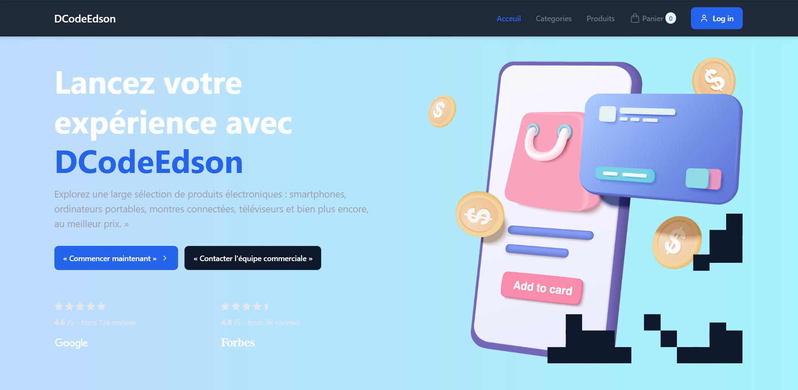
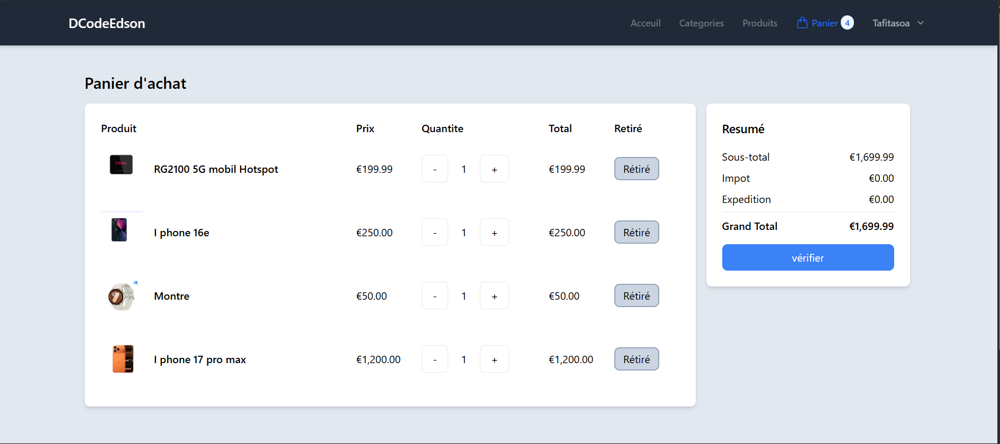
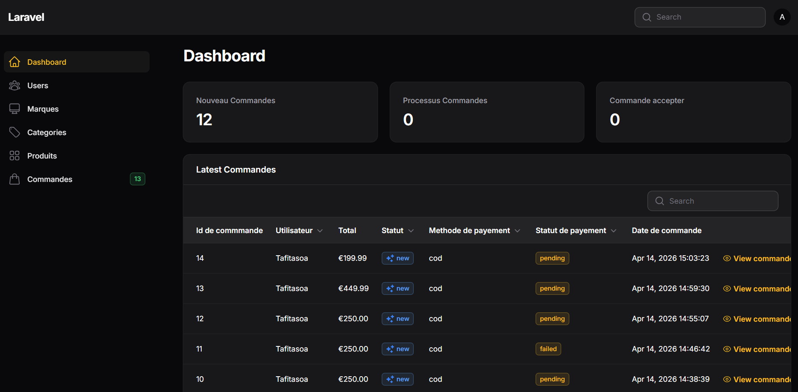

# 🛒 E-commerce Laravel Filament


Application e-commerce moderne développée avec Laravel, Filament et Livewire.  
Ce projet permet de gérer des produits, un panier, des commandes et un système de paiement en ligne.

---

## 🚀 Fonctionnalités

- 🛍️ Catalogue de produits
- 📂 Gestion des catégories
- 🛒 Panier (stocké en cookie)
- 📦 Gestion des commandes
- 👤 Authentification utilisateur
- 💳 Paiement avec Stripe
- 📧 Envoi d’emails (Mailtrap)
- ⚙️ Dashboard admin avec Filament

---

## 🛠️ Technologies utilisées

- Laravel
- Livewire
- Filament
- Tailwind CSS
- Stripe API
- Mailtrap
- MySQL

---

## ⚙️ Installation

### 1. Cloner le projet

```bash
git clone https://github.com/Ramanandafy/ecommerce-laravel-filament.git
cd ecommerce-laravel-filament 
```
### 2. Installer les dépendances

```bash
composer install
npm install
```

### 3. Configuration

```bash
cp .env.example .env
php artisan key:generate
```
### 4. Base de données

Configurer le fichier `.env` :

```env
DB_DATABASE=ecommerce
DB_USERNAME=root
DB_PASSWORD=
```

Puis exécuter :

```bash
php artisan migrate
```
### 5. Lancer le projet

```bash
php artisan serve
npm run dev
```

### 6. Configuration Stripe

```env
STRIPE_KEY=pk_test_xxx
STRIPE_SECRET=sk_test_xxx
```
### 7. Configuration Mailtrap

```env
MAIL_MAILER=smtp
MAIL_HOST=sandbox.smtp.mailtrap.io
MAIL_PORT=2525
MAIL_USERNAME=xxxx
MAIL_PASSWORD=xxxx
MAIL_FROM_ADDRESS=hello@example.com
MAIL_FROM_NAME="DCodeEdson"
```
## 👤 Accès Admin

- URL : http://localhost:8000/admin  
- Email : admin@gmail.com  
- Mot de passe : à définir dans la base de données  

---

## 🎯 Objectif du projet

Ce projet a été réalisé pour apprendre Laravel, Filament, Livewire et construire un système e-commerce complet avec paiement en ligne.

---

## 👨‍💻 Auteur

- Edson (Laravel Developer)
- GitHub : https://github.com/Ramanandafy

---
## 🚀 Remarques

Ce projet est encore en évolution.

---

## 🚀 Améliorations possibles

- dashboard client
- gestion des stocks avancée
- pagination produits
- déploiement en ligne

## 📸 Screenshots

### 🏠 Page d'accueil


### 🛍️ Produits


### 🛒 Panier


### ⚙️ Admin Filament
